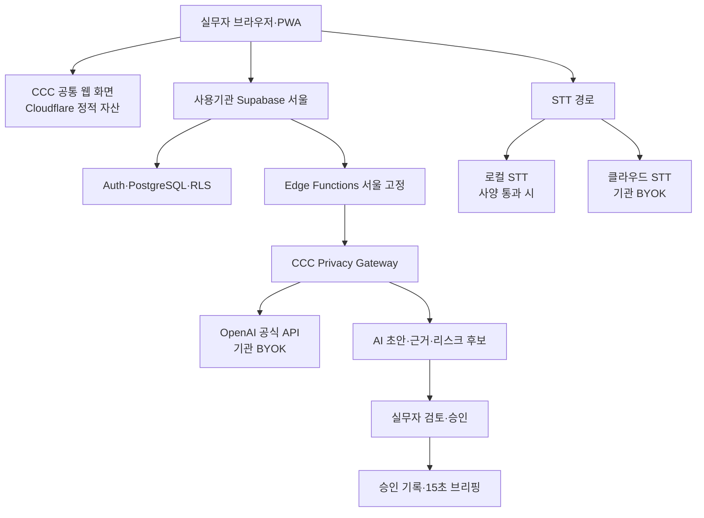

# ADR-0040: CCC Open Pilot v0.1 기관 소유형 웹·Privacy Gateway·BYOK

- 상태: Accepted (Notion 회수 원문)
- 결정일: 2026-09-01
- 목표 릴리스: 2026-09-18
- 대상: AI 챌린지 해 제출판과 실제 상담 파일럿
- 정본 용어: 사회연대은행, 사용기관, 실무자, 당사자
- 출처: Notion `2026-09-01 ADR-0040: CCC Open Pilot v0.1 기관 소유형 웹·Privacy Gateway·BYOK`

> **Superseded by ADR-0041 in part:** 이 ADR은 회수한 Accepted 원문을 역사 증거로 보존한다. ADR-0041이 대체하는 범위는 이 문서의 §8.2 음성 생명주기(audio retention)와 §14 제외 범위의 완전한 로컬 서버 배포 제외(local-server-exclusion)뿐이다. §1 결정 요약의 10번째 항목과 §17 미해결 검증 항목의 5번째 항목은 §8.2 보관 정책을 반복한 문장이므로 같은 범위에서 함께 대체한다. §8.1 STT 공급자, §9 동의 모델, §10부터 §13까지와 그 밖의 원문은 이 표식만으로 대체하지 않는다.
>
> **PR #210 구분:** 예전 PR #210의 문서는 이 ADR이 아니다. PR #210에서 재배정된 Supabase read-only preflight 결정은 `docs/adr/0042-supabase-read-only-preflight.md`의 ADR-0042와 D84로 보존한다. ADR-0041은 그 문서의 구 배포 문 정책, Workers relay와 원음 30일 정책만 대체하며, read-only `plan`과 시크릿 입력·출력 분리는 보존한다.

# Source page: 2026-09-01 ADR-0040: CCC Open Pilot v0.1 기관 소유형 웹·Privacy Gateway·BYOK

> 상태: Accepted
> 결정일: 2026-09-01
> 목표 릴리스: 2026-09-18
> 대상: AI 챌린지 해 제출판과 실제 상담 파일럿
> 정본 용어: 사회연대은행, 사용기관, 실무자, 당사자

# 1. 결정 요약

> CCC Open Pilot v0.1은 사회연대은행이 공개·배포하고, 사용기관이 자기 명의의 Supabase 서울 프로젝트와 OpenAI·STT 계정을 연결해 사용하는 기관 소유형 AI 상담 브리핑 웹앱으로 만든다.

핵심 결정은 다음과 같다.

1. 사용자는 프로그램을 개발 설치하지 않고 브라우저 또는 PWA로 사용한다.
1. 실제 상담 데이터는 사회연대은행 중앙 DB가 아니라 사용기관별 Supabase Pro 서울 프로젝트에 저장한다.
1. 민감 API, 개인정보 암복호화, OpenAI 호출은 기관 Supabase의 Edge Functions를 서울 리전으로 고정해 실행한다.
1. Azure Functions와 Key Vault는 기본형에 넣지 않는다. 기관이 추가 통제를 요구할 때 적용하는 후속 강화 프로필로 둔다.
1. LLM은 OpenAI 공식 API와 기관별 BYOK만 정식 지원한다. 사용자 화면에는 여러 모델 선택지를 노출하지 않고, 평가를 통과한 모델 하나를 설정값으로 고정한다.
1. 상담 원문을 그대로 보내지 않는다. CCC Privacy Gateway가 동의 확인, 직접 식별정보 치환, 준식별자 일반화, 목적별 최소 자료 선택을 자동 수행해 AI Packet만 전송한다.
1. OpenAI Responses API 요청에는 store:false를 강제하고, Files·Assistants·Vector Store·Background·장기 상태 저장 기능은 상담 데이터에 사용하지 않는다.
1. ZDR·MAM·한국 저장은 사전 승인이 필요한 Enhanced 모드로 제공한다. 일반 사용기관의 설치 필수조건으로 두지 않는다.
1. 클라우드 STT는 Azure Speech Fast Transcription을 우선 실측 후보로 삼고, 계약·리전·정확도·비용 검증 후 기본값을 확정한다. 로컬 STT는 사양 점검을 통과한 장비의 선택 경로다.
1. 음성 원본은 기본적으로 장기 저장하지 않는다. 처리 실패 복구를 위한 임시 보관만 허용하고, 별도 목적과 동의가 있을 때만 7일 또는 30일 보관을 선택한다.
1. AI 결과는 항상 초안이다. 근거 인용 검증과 실무자 승인을 통과해야 공식 기록과 15초 브리핑에 반영한다.
# 2. 결정 배경

CCC가 해결하는 현장 문제는 두 가지다.

- 상담 기록이 여러 회차에 흩어져 있어 다음 상담 전에 맥락을 빠르게 복원하기 어렵다.
- 수기 메모와 녹음 사이의 누락·불일치·리스크 후보를 사람이 매번 다시 찾기 어렵다.
대회의 우선순위는 임팩트와 확산성이다. 따라서 개발자가 없는 기관이 도입할 때 공급자 계정과 법무 절차가 계속 늘어나는 구조는, 구현을 완성하더라도 확산성이 낮다.

9월 1일 정책 리서치에는 Supabase + Azure Functions + Key Vault + Blob + OpenAI ZDR을 기본으로 두는 강화안이 제안됐다. 이 안은 통제 수준은 높지만 사용기관이 Supabase, Azure, OpenAI 세 환경을 모두 만들고 ZDR 승인까지 받아야 한다. 개발량과 무관하게 기관 온보딩 자체가 복잡해지는 문제가 남는다. 따라서 기본형은 하나의 기관 백엔드로 단순화하고, Azure 자원 분리는 선택형으로 내린다.

관련 조사와 기존 초안:

- 2026-09-01 최종 결정을 위한 정책 리서치
- 2026-09-01 1차 결론
- 2026-09-01 CCC Open Pilot v0.1: 기관 소유형 배포, STT, DB 백엔드, LLM ZDR 설계
# 3. 대안 비교

아래 점수는 실측 결과가 아니라, 사용자가 정한 우선순위를 적용한 설계 의사결정 점수다. 임팩트 30, 확산성 25, 사용성 20, 개인정보 통제 15, 비용 10으로 가중했다.

| 대안 | 임팩트 | 확산성 | 사용성 | 통제 | 비용 | 가중점수 |
| --- | --- | --- | --- | --- | --- | --- |
| A. Supabase 단일 기관 백엔드 + Privacy Gateway | 5 | 5 | 4 | 4 | 4 | 91/100 |
| B. Supabase + Azure Functions·Key Vault·Blob + ZDR 필수 | 5 | 2 | 2 | 5 | 2 | 67/100 |
| C. 사회연대은행 중앙 관리형 SaaS | 5 | 4 | 5 | 2 | 3 | 82/100 |
| D. 기관 PC 로컬 설치형 | 3 | 2 | 2 | 5 | 3 | 57/100 |

A안을 선택한다. 중앙 SaaS는 사용성은 높지만 사회연대은행이 모든 기관의 개인정보 수탁·장애·백업 책임을 떠안는다. 로컬형은 개인정보 반출을 줄이지만 다중 사용자, 업데이트, 백업과 저사양 장비 문제가 크다. 강화형 B는 후속 기관 요구에 대응할 수 있도록 설계 호환성만 남긴다.

# 4. 최종 제품 구조



## 4.1 사회연대은행이 운영하는 것

- 공개 랜딩과 가상데이터 데모
- 개인정보를 포함하지 않는 정적 웹 자산
- 공식 GitHub 저장소, 설치기, 마이그레이션, 릴리스
- 보안 패치, 호환성 검사, 매뉴얼
- 익명화된 임팩트 보고서 양식
## 4.2 사용기관이 소유하는 것

- Supabase 조직과 서울 프로젝트
- 상담 데이터와 사용자 계정
- OpenAI 및 STT API 계정·키·비용
- PII_ENC_KEY와 복구 사본
- 개인정보 처리 목적, 보유기간, 동의 문안 승인
- 업데이트 적용 시점과 사용자 권한
## 4.3 Cloudflare의 역할

Cloudflare는 정적 화면, 가상데이터 데모, 배포 파일과 업데이트 매니페스트에만 사용한다. 실제 상담 내용, 음성, 전사, OpenAI 요청은 Cloudflare Worker·D1·R2를 통과하지 않는다. URL, 오류 로그와 분석 이벤트에도 당사자·사례 식별자를 넣지 않는다.

# 5. 기관 백엔드

## 5.1 Supabase

사용기관마다 별도 Supabase Pro 서울 프로젝트를 사용한다.

- PostgreSQL: 공식 기록, 동의, 승인, 감사, 작업 상태
- Auth: 기관 관리자와 실무자 계정
- RLS: 기관·역할·담당 범위의 2차 접근 경계
- Edge Functions: Privacy Gateway, OpenAI·STT 토큰 발급, 정책 게이트
- Project Secrets: OpenAI 키, STT 키, PII 암호화 키
- Backups: DB 백업과 별도의 키 복구 절차
Edge Functions는 호출 시 ap-northeast-2를 명시하고 응답 헤더로 실제 실행 리전을 검사한다. 장애 시 자동으로 해외 리전에 우회하지 않고, 수기 기록 경로로 전환한다.

## 5.2 PII 암호화

직접 식별정보는 업무 기록과 분리한 PII 금고에 AES-256-GCM으로 암호화한다.

- 설치기가 기관별 암호화 키를 생성한다.
- 키는 Supabase Project Secret에 저장한다.
- 설치 완료 시 기관 관리자에게 암호화된 복구 사본을 한 번 제공한다.
- 사회연대은행은 키를 보관하지 않는다.
- 키 교체·재암호화·복구 테스트를 운영 명령으로 제공한다.
- 더 강한 키 관리가 필요한 기관은 후속 External KMS Profile로 Azure Key Vault 등을 연결할 수 있다.
# 6. CCC Privacy Gateway

Privacy Gateway는 사람이 매 상담마다 개인정보를 지우는 작업을 대신하는 핵심 제품 기능이다.

## 6.1 처리 순서

```plain text
동의·기관 정책 확인
→ 원본과 공식 기록을 기관 DB에서 읽기
→ 직접 식별정보 치환
→ 준식별정보 일반화
→ 목적에 필요한 회차와 필드만 선택
→ AI Packet 생성
→ 재식별 위험·잔여 PII 자동 검사
→ OpenAI 1회 호출
→ 출력 근거와 금지 판단 검사
→ AI 초안 저장
```

## 6.2 정보 분류

| 분류 | 예시 | 처리 |
| --- | --- | --- |
| 직접 식별정보 | 성명, 연락처, 이메일, 상세 주소, 계좌, 주민번호, 기관 내부 ID | 항상 치환 또는 제거 |
| 준식별정보 | 정확한 생년월일, 희귀 직장·학교, 좁은 지역, 구체 날짜 | 연령대·광역 지역·상대 시점 등으로 일반화 |
| 상담 의미정보 | 주거 불안, 채무 악화, 건강 상태, 폭력·착취 위험 | 동의한 목적에 필요한 범위만 유지 |
| 불필요한 맥락 | 관련 없는 과거 회차, 첨부파일, 연락처 목록 | 전송 제외 |

## 6.3 AI Packet 종류

- 회차 정리 패킷: 현재 회차의 마스킹 전사와 수기 메모, 회기 목표
- 내용 대조 패킷: 현재 회차와 같은 목표·분야에 연결된 승인 기록만
- 브리핑 패킷: 승인된 핵심 사실, 현재 목표, 미해결 액션, 확인된 리스크, 최근 변화
전체 사례 원문과 모든 과거 기록을 한 번에 보내지 않는다. AI Packet에는 출처 참조와 정확한 인용 구간을 포함하되 실제 이름이나 내부 식별자는 포함하지 않는다.

## 6.4 실패 정책

- 잔여 PII 또는 재식별 위험이 기준을 넘으면 외부 호출을 시작하지 않는다.
- 자동 검사 실패는 기록 저장을 막지 않는다.
- 실무자는 수기 기록을 계속 사용하고, 관리자에게 내용 없는 오류 코드가 전달된다.
- 반복 실패 사례는 마스킹 규칙 개선용으로 분류하되 원문을 중앙 수집하지 않는다.
# 7. OpenAI 정책

## 7.1 정식 지원 범위

- OpenAI 공식 API만 지원
- 기관별 BYOK
- Responses API
- 구조화 JSON 출력
- 요청마다 store:false
- 한 회차 AI 초안은 원칙적으로 한 번의 모델 호출
- 모델명은 평가를 통과한 하나를 관리자가 설정하며 실무자는 선택하지 않음
현재 구현의 claims, questions, oneLiner, contrast, flagSuggestions 구조와 정확한 원문 인용 검증을 유지한다. 리스크 후보는 모델 하나가 제시하되 코드 검증과 사람 승인을 거치므로 여러 LLM을 호출하지 않는다.

## 7.2 Standard De-identified 모드

일반 사용기관의 현실적인 기본 경로다.

- Privacy Gateway를 통과한 AI Packet만 전송
- store:false 강제
- 학습 사용 opt-in 금지
- OpenAI 저장형 도구 사용 금지
- 기본 오남용 모니터링 로그가 최대 30일 존재할 수 있음을 고지
- 민감정보 처리와 국외이전에 관한 기관 정책·동의 확인
OpenAI의 현재 DPA에는 계획된 민감정보 전송을 기본 전제로 하지 않는 문구가 있다. 따라서 실데이터 개방 전 다음 중 하나를 충족해야 한다.

1. AI Packet이 직접·준식별정보를 제거해 외부 수신자 관점에서 개인을 식별하기 어려운 수준이라는 법률·개인정보 검토를 통과한다.
1. OpenAI로부터 해당 사용 목적과 보호조치를 포함한 서면 확인 또는 추가 계약 조건을 확보한다.
이 검토가 끝나기 전에는 합성·가상 데이터만 사용한다.

## 7.3 Enhanced 모드

- 기관 OpenAI Organization 또는 Project가 MAM·ZDR 승인을 받은 경우 활성화
- 한국 저장 프로젝트는 승인된 기관만 kr.api.openai.com을 사용
- 한국 저장이 추론 처리까지 한국에서 수행됨을 의미하지 않으므로 국외 처리 고지는 유지
- 승인 상태는 관리자가 증거 참조와 확인일을 입력하고, 연결 검사 결과와 함께 기록
ZDR은 비개발 기관 전체에 요구하는 가입 조건이 아니다. 승인되지 않은 기관은 Standard De-identified 모드를 사용하거나 AI 기능을 잠근다.

# 8. STT와 음성 원본

## 8.1 STT 공급자

제출판에서는 사용자에게 여러 엔진을 동시에 노출하지 않는다.

- 클라우드 우선 실측 후보: Azure Speech Fast Transcription, 기관 BYOK
- 로컬 선택 경로: 설치기 벤치마크를 통과한 장비의 로컬 STT
- 후속 도전자: 계약과 정확도 검증을 마친 국내 사업자
Azure Speech는 오디오 파일을 multipart 요청으로 직접 받을 수 있으므로 Azure Blob을 기본 필수 구성으로 두지 않는다. 서비스의 오디오·전사 로깅은 기본 OFF를 유지하고 설치 검사가 이를 확인한다.

## 8.2 음성 생명주기

| 모드 | 원본 위치 | 삭제 |
| --- | --- | --- |
| 기본 임시 처리 | 사용자 기기 또는 암호화된 임시 객체 | 전사 성공·업로드 확인 후 즉시, 최대 24시간 |
| 7일 품질 확인 | 기관 소유 비공개 저장소 | 7일 자동 삭제 |
| 30일 증거 보관 | 기관 소유 한국 리전 저장소 | 30일 자동 삭제 |

7일·30일 모드는 기관이 목적을 입력하고 당사자에게 보유기간을 고지한 경우에만 활성화한다. 용량이 작다는 이유만으로 장기 보관하지 않는다. 보관 위치는 기본 설치와 분리된 승인 저장소 어댑터를 사용한다. Azure Blob Korea Central은 첫 번째 선택 어댑터이며, Supabase Storage는 CDN·백업 특성을 이해하고 별도 승인을 받은 기관만 사용한다.

최종 장기 기록은 승인된 전사 텍스트, 상담 기록, AI 근거, 수정·승인 이력, 음성 삭제 증거다.

# 9. 동의 모델

동의는 다음 여섯 영역으로 분리한다.

| 영역 | 미동의 시 |
| --- | --- |
| 개인정보 수집·이용 | 기관 정책에 따라 등록 제한 |
| 민감정보 처리 | 해당 민감정보 입력·처리 제한 |
| 상담 녹음 | 녹음 버튼 비활성, 수기 기록 사용 |
| 외부 STT 처리 | 클라우드 STT 비활성, 로컬 또는 수기 사용 |
| 외부 LLM·국외 처리 | OpenAI 비활성, 수기 기록 사용 |
| 음성 원본 보유기간 | 기본 임시 처리 후 삭제 |

각 동의 사건은 항목, 결정, 공급자, 목적, 문안 버전, 문안 해시, 효력 시각, 기록자를 append-only로 보존한다. 기존 녹음·텍스트 AI 동의를 새 동의로 자동 승격하지 않는다.

# 10. 설치·업데이트

기관 관리자는 AI 코딩 에이전트 또는 수동 매뉴얼을 사용하지만, 실제 변경은 버전이 고정된 설치기가 수행한다.

```plain text
ccc preflight
ccc provision
ccc configure
ccc verify
ccc doctor
ccc update
ccc rollback
ccc report
```

기관 담당자가 직접 작성하지 않는 것:

- SQL과 RLS
- Edge Function 코드
- OpenAI 프롬프트와 JSON Schema
- 암호화 코드
- 보존·삭제 스케줄
사람이 직접 승인하는 것:

- Supabase·OpenAI·STT 약관과 결제
- 기관 개인정보 정책과 보유기간
- 동의 문안
- API 키 입력
- 실제 데이터 모드 개방
# 11. 실제 데이터 개방 게이트

| 게이트 | 개방 기능 | 통과 조건 |
| --- | --- | --- |
| G0 | 가상데이터 데모 | 설치·종단 테스트 성공 |
| G1 | 수기 기록 | Auth·RLS·암호화·백업·복구 통과 |
| G2 | 녹음·STT | 동의, 공급자 설정, 로깅 OFF, 삭제 시험 통과 |
| G3 | OpenAI 처리 | Privacy Gateway, store:false, 동의·국외이전, DPA 사용목적 검토 통과 |
| G4 | 외부기관 파일럿 | 깨끗한 계정에서 독립 설치·복구·롤백 성공 |

# 12. 사회연대은행의 접근과 지원

사회연대은행 원격지원 계정은 기본적으로 생성하지 않는다.

- 기본 지원은 상담 내용이 없는 ccc report 진단 보고서로 진행한다.
- 후속 원격지원 기능을 만들 경우 기관 관리자가 범위와 만료시간을 명시해 일시 권한을 발급한다.
- 원본 음성·전사·상담 기록 열람은 별도의 명시적 승인 없이는 불가능하게 한다.
- 모든 지원 접근은 감사 로그에 남긴다.
# 13. 임팩트 측정

기관이 상담 내용 없이 다음 지표를 수집하고 익명 보고서로 내보낼 수 있게 한다.

- 상담 기록 작성 시작부터 승인까지 걸린 시간
- AI 초안에서 수정된 문장·항목 비율
- 수기 메모에 없던 전사 근거 발견 수
- 다음 상담 브리핑 열람부터 상담 시작까지 시간
- STT·AI 실패 및 수기 폴백 횟수
- 설치·업데이트·복구 성공 여부
- 실무자 만족도와 재사용 의향
사회연대은행은 원문 이벤트를 수집하지 않고 기관이 내보낸 집계 보고서만 받는다.

# 14. 제외 범위

9월 18일 제출판에서 제외한다.

- 사회연대은행 중앙 멀티테넌트 DB
- Azure Functions·Key Vault·Blob의 의무 사용
- 완전한 로컬 서버 배포판
- OpenAI 외 다중 LLM 선택 UI
- 여러 LLM의 합의·교차검증
- AI의 지원 지속·중단 결정, 심리 진단, 점수 자동 산정
- 승인 없는 자동 공식 기록
- 기관 간 원문 공유와 중앙 사례 분석
# 15. 기존 계획에 미치는 영향

다음 구현 계획은 이 ADR에 맞춰 수정해야 한다.

- 2026-08-31-supabase-platform-cutover.md: Workers·Hyperdrive·Supabase Storage 원음 경로를 기관 Edge Functions와 새 AudioStore 정책으로 변경
- 2026-08-31-stt-consent-cutover.md: CLOVA·RTZR·Qwen 전체 동시 구현 대신 Azure 우선 벤치마크와 동의 6영역으로 변경
- 2026-08-31-supabase-stt-orchestration.md: 두 공급자 트랙보다 Privacy Gateway, Supabase, STT 순으로 재편
현재 코드에서 유지할 것:

- 마스킹된 transcript와 text_context 재료 계약
- 정확한 근거 인용과 source hash
- claims, questions, oneLiner, contrast, flagSuggestions
- 리스크 타입 허용목록과 금지 판단 검사
- AI 실패 시 기록 저장을 막지 않는 원칙
- 녹음 동의와 텍스트 AI 동의를 분리한 DB 현재값·이력 구조
즉시 고칠 것:

- OpenAI 요청에 store:false 추가
- 동의 화면에서 녹음·STT·LLM을 다시 분리
- Privacy Gateway의 준식별자 일반화와 패킷 위험 검사
- Cloudflare D1·R2·Access 의존을 Supabase 기관 백엔드로 전환
- 설치기와 실제 데이터 개방 게이트 구현
# 16. 결과와 감수할 단점

## 긍정적 결과

- 사용기관은 Supabase, OpenAI, STT 세 계정만 준비하고 서버를 운영하지 않는다.
- 사회연대은행이 실제 상담 데이터와 API 키를 보유하지 않는다.
- AI가 핵심 기능으로 유지되면서도 전체 사례 원문 전송을 피한다.
- ZDR 승인을 받지 못한 소규모 기관도 조건부 표준 경로를 검토할 수 있다.
- 외부 KMS와 로컬판을 나중에 추가할 수 있다.
## 감수할 단점

- Supabase 한 공급자에 DB·Auth·Functions가 집중된다.
- Standard OpenAI 모드는 최대 30일 오남용 로그 가능성을 완전히 없애지 못한다.
- 강한 자동 비식별화는 일부 상담 맥락을 일반화해 AI 성능을 낮출 수 있다.
- 클라우드 STT 품질과 비용은 실제 한국어 상담 음성으로 검증해야 한다.
- 기관이 자신의 API 계정과 비용을 관리해야 한다.
# 17. 미해결 검증 항목

1. Azure Speech Korea Central의 실제 기관 계정 가격과 상담체 정확도
1. Privacy Gateway가 만드는 AI Packet의 재식별 위험 법률 검토
1. OpenAI DPA상 계획된 상담 민감정보 처리에 대한 서면 확인 또는 추가 계약 필요 여부
1. Standard 모드 국외이전·최대 보관 가능성 동의 문안
1. 기관별 기본 음성 보관값을 24시간, 7일 중 어느 것으로 안내할지 실무자 테스트
1. 깨끗한 기관 계정에서 Supabase·OpenAI·STT 온보딩 시간
# 18. 근거 자료

- OpenAI Data Controls
- OpenAI Data Processing Addendum
- Supabase Edge Functions
- Supabase Regional Invocations
- Supabase Storage CDN
- Supabase Database Backups
- Azure Speech Fast Transcription
- Azure Speech Logging
- 개인정보 보호법 제23조 민감정보
- 2026-09-11 시행 개인정보 보호법
> 이 ADR은 제품·기술 의사결정 정본이다. 실제 데이터 개방 전 개인정보·국외이전·처리위탁 문안과 OpenAI 사용 목적은 법률 검토 또는 책임자 승인을 통과해야 한다.
